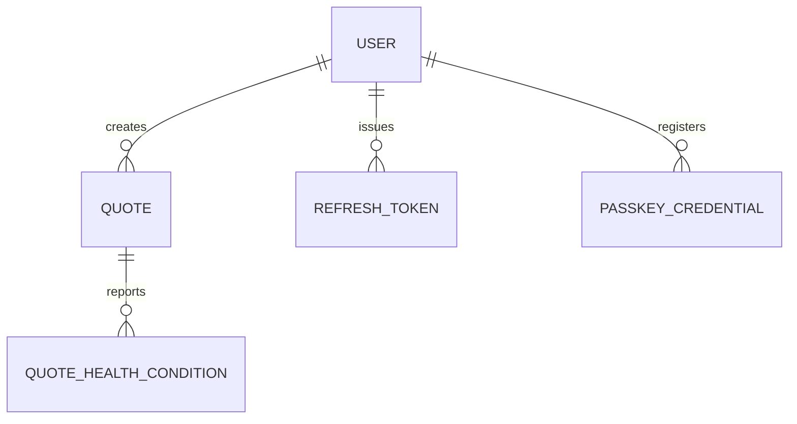

# Entity Model

## Entity Relationship Diagram

### QUOTE

A single insurance quote request moving through the draft-to-submission lifecycle for one applicant.

| Attribute                     | Description                                              | Data Type | Length/Precision | Validation Rules                                                |
|--------------------------------|------------------------------------------------------------|-----------|-------------------|------------------------------------------------------------------|
| id                             | Unique identifier                                          | String    | 36                | Primary Key, Format: UUID                                        |
| user_id                        | User who created the quote                                 | String    | 36                | Not Null, Foreign Key (USER.id)                                  |
| name                           | Applicant's full name                                      | String    | 120               | Not Null                                                          |
| email                          | Applicant's email address                                  | String    | 254               | Not Null, Format: Email                                           |
| age                            | Applicant's age in years                                   | Integer   | 3                 | Not Null, Min: 18, Max: 120                                       |
| zip_code                       | Applicant's postal code                                    | String    | 10                | Not Null, Format: 5-digit numeric                                 |
| coverage_type                  | Selected coverage tier                                     | String    | 20                | Optional, Values: BASIC, STANDARD, PREMIUM                        |
| has_preexisting_conditions     | Whether the applicant reported any preexisting condition    | Boolean   | —                 | Optional                                                          |
| takes_prescription_medication  | Whether the applicant takes prescription medication         | Boolean   | —                 | Optional                                                          |
| uses_tobacco                   | Whether the applicant uses tobacco                          | Boolean   | —                 | Optional                                                          |
| needs_spouse_coverage          | Whether spouse coverage is requested                        | Boolean   | —                 | Optional                                                          |
| monthly_premium                | Server-computed monthly premium                             | Decimal   | 10,2              | Optional, Min: 0                                                  |
| status                         | Current lifecycle state                                     | String    | 30                | Not Null, Values: DRAFT, SUBMITTED, SUBMISSION_FAILED, EXPIRED    |
| created_at                     | Creation timestamp                                          | DateTime  | —                 | Not Null                                                          |
| updated_at                     | Last modification timestamp                                 | DateTime  | —                 | Not Null                                                          |
| version                        | Optimistic-locking version counter                          | Integer   | 19                | Not Null, Min: 0                                                  |

### QUOTE_HEALTH_CONDITION

A single self-reported health condition associated with a quote's coverage selection; only recorded for applicants over 65 (BR-011).

| Attribute | Description                        | Data Type | Length/Precision | Validation Rules                                                                    |
|-----------|-------------------------------------|-----------|-------------------|---------------------------------------------------------------------------------------|
| quote_id  | Quote this condition belongs to     | String    | 36                | Not Null, Foreign Key (QUOTE.id)                                                      |
| condition | Reported condition code             | String    | 30                | Not Null, Values: DIABETES, HEART_DISEASE, HYPERTENSION, CANCER_HISTORY, OTHER        |

### USER

A registered account holder who can authenticate to create and manage insurance quotes.

| Attribute      | Description                    | Data Type | Length/Precision | Validation Rules          |
|----------------|----------------------------------|-----------|-------------------|-----------------------------|
| id             | Unique identifier                | String    | 36                | Primary Key, Format: UUID    |
| username       | Login identifier                 | String    | 60                | Not Null, Unique             |
| role           | Authorization role               | String    | 20                | Not Null, Values: USER, ADMIN  |
| password_hash  | Hashed account password           | String    | 100               | Not Null                     |
| created_at     | Account creation timestamp       | DateTime  | —                 | Not Null                     |

### REFRESH_TOKEN

An issued renewable session token enabling session renewal without re-authentication, tracked in rotation families to detect reuse (BR-005).

| Attribute   | Description                                | Data Type | Length/Precision | Validation Rules                  |
|-------------|-----------------------------------------------|-----------|-------------------|--------------------------------------|
| id          | Unique identifier                              | String    | 36                | Primary Key, Format: UUID             |
| user_id     | Owning user                                    | String    | 36                | Not Null, Foreign Key (USER.id)       |
| token_hash  | One-way hash of the raw token, used for lookup | String    | 64                | Not Null, Unique                      |
| family_id   | Rotation family identifier                     | String    | 36                | Not Null, Format: UUID                |
| expires_at  | Expiration timestamp                           | DateTime  | —                 | Not Null                              |
| revoked_at  | Revocation timestamp, if revoked               | DateTime  | —                 | Optional                              |
| created_at  | Issuance timestamp                             | DateTime  | —                 | Not Null                              |

### PASSKEY_CREDENTIAL

A WebAuthn passkey credential registered by a user for passwordless or multi-factor sign-in (UC-002).

| Attribute        | Description                              | Data Type | Length/Precision | Validation Rules                |
|------------------|---------------------------------------------|-----------|-------------------|------------------------------------|
| id               | Unique identifier                            | String    | 36                | Primary Key, Format: UUID           |
| user_id          | Owning user                                  | String    | 36                | Not Null, Foreign Key (USER.id)     |
| credential_id    | WebAuthn credential identifier                | String    | 400               | Not Null, Unique                    |
| public_key_cose  | COSE-encoded public key, stored as binary     | String    | —                 | Not Null                            |
| signature_count  | WebAuthn signature counter, used to detect credential cloning | Integer | 19        | Not Null, Min: 0                    |
| created_at       | Registration timestamp                        | DateTime  | —                 | Not Null                            |

## Notes

- Every quote is owned by the user who created it through `QUOTE.user_id`. Regular users can read and mutate only their own quotes; administrators have read-only oversight across all quotes.
- The Spring Modulith event-publication (outbox) table backing `QuoteSubmitted` → Kafka delivery is a technical/infrastructure table, not a domain entity, and is intentionally excluded here.
