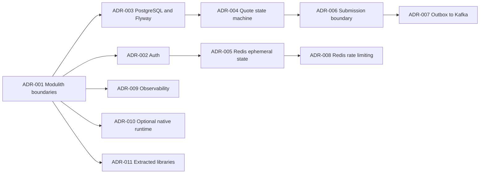

# ADR catalogue, documentation, and demo recordings Implementation Plan

> **For agentic workers:** REQUIRED SUB-SKILL: Use superpowers:executing-plans to implement this plan task-by-task.

**Goal:** Align the active architecture records with the implemented system, make both repositories self-explanatory, and generate repeatable Playwright videos for the real user journeys.

**Architecture:** The backend remains the source of truth for the ADR catalogue and service architecture. The frontend owns browser-facing documentation and a real-stack Playwright recording suite. A manual GitHub Actions workflow runs the recordings against the ephemeral JVM Compose stack and uploads videos as artifacts; no binary recordings are committed.

**Tech Stack:** Markdown, Mermaid, GitHub Actions, Bun, Playwright 1.61.1, Spring Boot Java 17, Docker Compose, PostgreSQL, Redis, Kafka, WireMock, Prometheus, Grafana, Loki, and Tempo.

## Global Constraints

- Preserve DDD, hexagonal, Spring Modulith boundaries and Java 17 runtime compatibility.
- Keep Kafka as durable business-event transport; Actuator/Micrometer/Prometheus remain the metrics path.
- Keep PostgreSQL as durable source of truth; Redis remains shared ephemeral state and rate-limit storage.
- Keep same-origin `/api` browser traffic and real API-backed Playwright journeys.
- Archive the obsolete Caffeine decision instead of silently presenting it as active.
- Do not commit generated video binaries; upload them from the manual recording workflow.
- Preserve unrelated existing worktree edits in both repositories.

---

### Task 1: Rebuild the active ADR catalogue

**Files:**
- Create: `insurance-quotes-service/docs/decisions/ADR-001-spring-modulith-package-boundaries.md`
- Create: `insurance-quotes-service/docs/decisions/ADR-002-jwt-refresh-webauthn-authentication.md`
- Create: `insurance-quotes-service/docs/decisions/ADR-003-postgresql-flyway-durable-persistence.md`
- Create: `insurance-quotes-service/docs/decisions/ADR-004-data-driven-quote-state-machine.md`
- Create: `insurance-quotes-service/docs/decisions/ADR-005-redis-shared-ephemeral-state.md`
- Create: `insurance-quotes-service/docs/decisions/ADR-006-submission-outside-transaction.md`
- Create: `insurance-quotes-service/docs/decisions/ADR-007-outbox-kafka-events.md`
- Create: `insurance-quotes-service/docs/decisions/ADR-008-redis-rate-limiting.md`
- Create: `insurance-quotes-service/docs/decisions/ADR-009-observability-stack.md`
- Create: `insurance-quotes-service/docs/decisions/ADR-010-optional-native-runtime.md`
- Create: `insurance-quotes-service/docs/decisions/ADR-011-early-extracted-libraries.md`
- Create: `insurance-quotes-service/docs/decisions/archive/ADR-003-caffeine-cache-superseded.md`
- Delete: old ADR files after content is migrated and references are updated.

**Interfaces:**
- Consumes: current source/config evidence from the design checkpoint.
- Produces: 11 active records with stable new numbering and one explicitly archived superseded decision.

- [ ] **Step 1: Write the active records and archive the Caffeine decision**

Each active record must contain the following sections, with implementation-specific content:

```markdown
# ADR-NNN: Decision title

## Status
Accepted

## Date
2026-07-28

## Decision
One precise statement of the selected architecture.

## Context and decision drivers
The current system constraints and forces.

## Considered alternatives
At least two alternatives and why they were rejected.

## Implementation evidence
Exact source/configuration locations that prove the decision is real.

## Consequences
Positive, negative, operational, and security/runtime consequences.

## Related decisions
Links to active or archived records.
```

The archived Caffeine file must state `Superseded` and link to ADR-005. ADR-005 must explicitly state that Redis handles quote cache and WebAuthn ceremonies, while ADR-008 separately owns HTTP rate-limit buckets.

- [ ] **Step 2: Update all cross-references**

Run:

```bash
rg -n 'ADR-(001|002|003|004|005|006|007|008|009|010|011|013)|caffeine|Caffeine' . --glob '!target/**'
```

Update README, specs, plans, PR text, and ADR links to the new active paths. References to the old Caffeine decision must say archived/superseded, not active.

- [ ] **Step 3: Validate and commit the ADR slice**

Run:

```bash
git diff --check
! rg -n '^## (TBD|TODO)|TBD|FIXME' docs/decisions
```

Commit:

```bash
git add docs/decisions
git commit -m "docs: reorganize architecture decision records"
git push origin feat-backend-core
```

Expected: active ADRs are numbered 001–011, the Caffeine decision is archived, and the remote branch contains the commit.

### Task 2: Add the ADR index and relationship map

**Files:**
- Create: `insurance-quotes-service/docs/decisions/README.md`
- Create: `insurance-quotes-service/docs/decisions/decision-flow.md`

**Interfaces:**
- Consumes: active and archived ADR paths from Task 1.
- Produces: navigable index, lifecycle guidance, old-to-new mapping, and Mermaid dependency flow.

- [ ] **Step 1: Create the index**

The index must include a table with all 11 active ADRs, status, impact, and links; a separate archived table; lifecycle definitions; and the rule that accepted decisions are changed by superseding records.

- [ ] **Step 2: Create the relationship map**

Include a Mermaid graph that shows:



Add prose clarifying that Kafka is not the metrics pipeline and Redis is not durable business state.

- [ ] **Step 3: Validate and commit the index slice**

Run:

```bash
git diff --check
```

Commit:

```bash
git add docs/decisions/README.md docs/decisions/decision-flow.md
git commit -m "docs: add architecture decision index"
git push origin feat-backend-core
```

### Task 3: Rewrite both READMEs and pull-request descriptions

**Files:**
- Modify: `insurance-quotes-service/README.md`
- Modify: `insurance-quotes-web/README.md`
- External metadata: PR 1 body in both GitHub repositories.

**Interfaces:**
- Consumes: ADR index, existing setup guide, latest successful CI run URLs, and recording gallery.
- Produces: consistent onboarding and review documentation with repository-specific ownership.

- [ ] **Step 1: Rewrite backend README**

Include Quick Start, architecture diagram, module tree, durable/ephemeral/event ownership table, auth credentials/passkey setup, API/versioning, observability ports, JVM/native policy, CI behavior, ADR index, demo links, troubleshooting, and challenge requirement mapping.

- [ ] **Step 2: Rewrite frontend README**

Include product overview, app flow diagram, sibling backend layout, HMR and production setup, same-origin proxy, localization/test-ID API, responsive shell behavior, Playwright commands, demo gallery, CI behavior, and challenge requirement mapping.

- [ ] **Step 3: Update both PR bodies safely**

Use `gh pr view 1 --json body` to preserve existing details, then `gh pr edit 1 --body-file`. The updated body must link only to active ADR paths, the archive note, latest green Actions runs, setup docs, and the demo gallery. Do not include stale failed runs as current evidence.

- [ ] **Step 4: Commit repository README slices**

Commit backend and frontend documentation independently:

```bash
git add README.md
git commit -m "docs: improve backend project guide"
git push origin feat-backend-core

git add README.md docs/demo
git commit -m "docs: improve frontend project guide"
git push origin feat-frontend
```

### Task 4: Add Playwright demo recordings

**Files:**
- Create: `insurance-quotes-web/e2e/tests/demo-recordings.spec.ts`
- Modify: `insurance-quotes-web/e2e/package.json` if a named recording script is needed.
- Modify: `insurance-quotes-web/e2e/playwright.config.ts` only if artifact output needs a stable directory.

**Interfaces:**
- Consumes: `tid`, `stubInsurer`, `loginWithPassword`, `skipEnrollmentIfShown`, `enableVirtualAuthenticator`, and existing real API helpers.
- Produces: six named tests with Playwright video output and no mocked browser API.

- [ ] **Step 1: Add recording tests**

Use this structure:

```ts
test.describe('Clara flow recordings', () => {
  test.use({ video: 'on' });

  test('01-standard-quote', async ({ page }) => {
    // login → standard coverage → premium → submit success
  });

  test('02-senior-health-quote', async ({ page }) => {
    // age 70 → diabetes + hypertension → premium → submit success
  });

  test('03-submission-retry', async ({ page }) => {
    // WireMock 500 → visible failure → WireMock 200 → retry success
  });

  test('04-passkey-lifecycle', async ({ context, page }) => {
    // virtual authenticator → enrollment → MFA → passwordless login
  });

  test('05-history-and-analytics', async ({ page }) => {
    // Home latest four → history filters/order/page navigation
  });

  test('06-observability', async ({ page }) => {
    // authenticated API request → dashboard navigation → no browser errors
  });
});
```

Each test must assert the final user-visible outcome and use the existing console guard. The passkey test runs last or uses an isolated demo user because it mutates credential state.

- [ ] **Step 2: Add the recording command**

Add:

```json
"test:recordings": "playwright test tests/demo-recordings.spec.ts --project=desktop-chromium --retries=0"
```

- [ ] **Step 3: Run the suite locally against the real stack**

Run:

```bash
E2E_BASE_URL=http://localhost:3100 bun run --filter e2e test:recordings
```

Expected: six tests pass and Playwright creates one video per test under its ignored output directory.

### Task 5: Add recording workflow and hyperframe gallery

**Files:**
- Create: `insurance-quotes-web/.github/workflows/demo-recordings.yml`
- Create: `insurance-quotes-web/docs/demo/flow-hyperframes.md`
- Modify: `insurance-quotes-web/README.md`

**Interfaces:**
- Consumes: the real Compose stack, frontend `feat-frontend`, backend `feat-backend-core`, and Task 4 recording command.
- Produces: manually dispatchable workflow with uploaded recordings and a Markdown visual gallery.

- [ ] **Step 1: Add manual recording workflow**

The workflow must:

- use `workflow_dispatch` inputs for `frontend_ref` and `backend_ref`;
- install Bun and pinned Chromium;
- validate Compose configuration;
- start PostgreSQL, Kafka, Redis, WireMock, API, and web services;
- wait for API health and web readiness;
- run `test:recordings` with retries disabled;
- upload `e2e/test-results` and `e2e/playwright-report` with `if: always()`;
- tear down the stack with `if: always()`.

- [ ] **Step 2: Create the hyperframe gallery**

For each recording, include:

```markdown
<details>
<summary>01 · Standard quote</summary>

| Setup | Action | Outcome |
|---|---|---|
| Sign in | Choose standard coverage | Quote submitted |

**Test:** [`demo-recordings.spec.ts`](../../e2e/tests/demo-recordings.spec.ts)
**Artifact:** `clara-demo-recordings-<run-id>`
</details>
```

Add a Mermaid journey map, local reproduction command, artifact download instructions, and explicit note that recordings exercise real API boundaries.

- [ ] **Step 3: Commit and push the recording slice**

Run frontend formatting and E2E lint/build, then commit:

```bash
git add .github/workflows/demo-recordings.yml e2e/package.json e2e/tests/demo-recordings.spec.ts docs/demo README.md
git commit -m "test: add full-flow Playwright demo recordings"
git push origin feat-frontend
```

### Task 6: Final verification and handoff

**Files:**
- Modify: `insurance-quotes-service/tasks/todo.md`
- Modify: `insurance-quotes-web/tasks/todo.md`

- [ ] **Step 1: Validate documentation links and formatting**

Run in backend:

```bash
git diff --check
! rg -n 'ADR-013|ADR-012|ADR-003-caffeine-cache\.md' README.md docs/decisions --glob '*.md' --glob '!archive/**'
```

Run in frontend:

```bash
bunx prettier --check README.md docs/demo e2e/tests/demo-recordings.spec.ts e2e/package.json .github/workflows/demo-recordings.yml
bun run --filter e2e lint
bun run --filter e2e build
```

- [ ] **Step 2: Run backend and frontend verification**

Run:

```bash
mvn -B -pl service -am verify -DskipITs
bun run test
bun run build
```

- [ ] **Step 3: Verify fresh Actions runs and git hygiene**

Use `gh run list` and `gh pr checks` for both repositories. Confirm the current head runs are green, and confirm only the known unrelated worktree edits remain unstaged.

- [ ] **Step 4: Document results and push final task notes**

Update both task files with command evidence, then commit only those task-file updates and push each branch.
